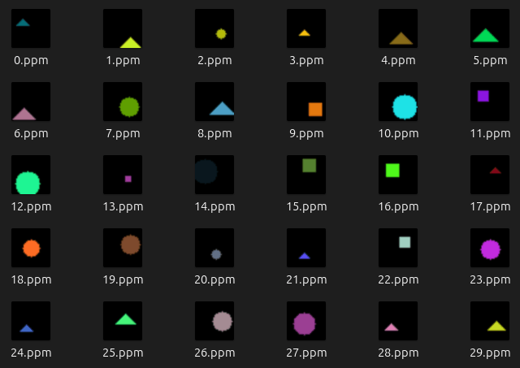
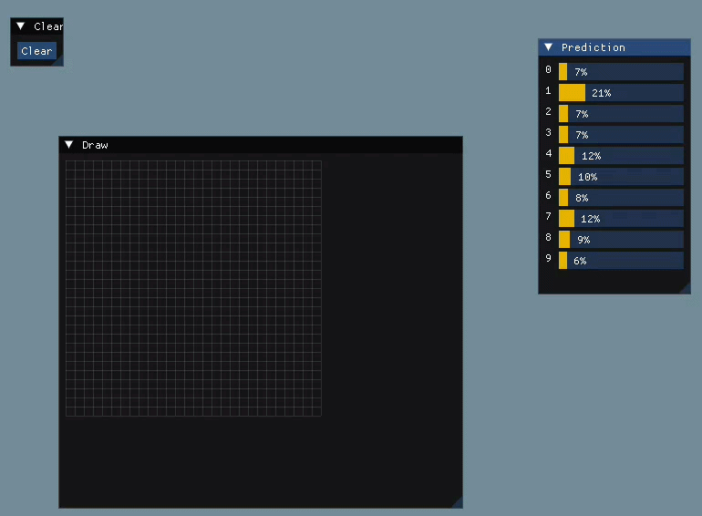
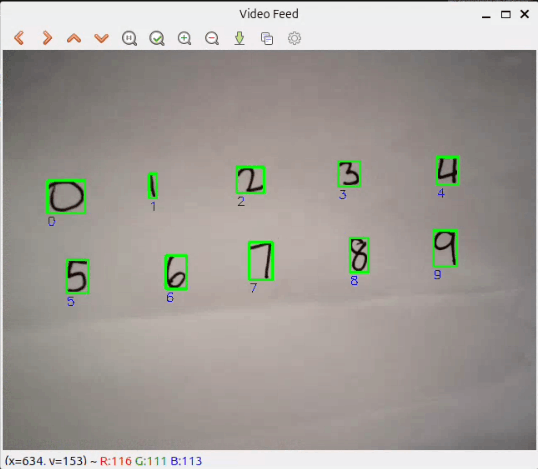

# Examples

The `/examples` directory contains sample use cases for this CNN. They are outlined below. Running these examples with release builds can provide greater performance compared to debug builds.

## Datasets

### MNIST

[`example_mnist_train`](/examples/example_mnist_train/) demonstrates training the below CNN on the [MNIST CSV](https://github.com/phoebetronic/mnist) dataset.

```cpp
const int BATCH_SIZE = 32;
Sequential nn{ makeSizeInfoCNN(BATCH_SIZE, 28, 28, 1) };
nn.add<Conv2D>(Activation::ReLU, 16, 3, 3);
nn.add<MaxPool2D>(2, 2);
nn.add<Conv2D>(Activation::ReLU, 32, 3, 3);
nn.add<MaxPool2D>(2, 2);
nn.add<Conv2D>(Activation::ReLU, 64, 3, 3);
nn.add<Flatten>();
nn.add<Linear>(Activation::ReLU, 128);
nn.add<Linear>(Activation::Softmax, 10);
```

The commands used to run the example and a sample training log are shown below. The above model architecture can achieve a high test accuracy (98.8%) in just 2 epochs of training.

```shell
$ xmake f -p linux -a x86_64 -m release # Configure the build
$ xmake build download_mnist_csv        # Download the dataset
$ xmake build example_mnist_train       # Build the example
$ xmake run example_mnist_train         # Run the example
===== Epoch 1 =====
Iteration = 200 Acc = 0.9554    Loss = 0.152268
Iteration = 400 Acc = 0.972133  Loss = 0.0942822
Iteration = 600 Acc = 0.9744    Loss = 0.0530827
Iteration = 800 Acc = 0.97395   Loss = 0.147216
Iteration = 1000        Acc = 0.96685   Loss = 0.242029
Iteration = 1200        Acc = 0.9851    Loss = 0.0498357
Iteration = 1400        Acc = 0.981233  Loss = 0.138397
Iteration = 1600        Acc = 0.984983  Loss = 0.0244263
Iteration = 1800        Acc = 0.98775   Loss = 0.0058602
===== Epoch 2 =====
Iteration = 2000        Acc = 0.973     Loss = 0.156127
Iteration = 2200        Acc = 0.9818    Loss = 0.239508
Iteration = 2400        Acc = 0.986517  Loss = 0.0038872
Iteration = 2600        Acc = 0.9896    Loss = 0.317561
Iteration = 2800        Acc = 0.990083  Loss = 0.0194856
Iteration = 3000        Acc = 0.989917  Loss = 0.00118679
Iteration = 3200        Acc = 0.987083  Loss = 0.000940961
Iteration = 3400        Acc = 0.990667  Loss = 0.0171245
Iteration = 3600        Acc = 0.989217  Loss = 0.00881928
Test accuracy: 0.9881
```

### Synthetic RGB dataset

[`example_synthetic_train`](/examples/example_synthetic_train/) demonstrates training the below CNN to classify shapes (triangles, circles, and squares) of varying positions, sizes, and colors. This dataset serves to test the CNN on multi-channel inputs before moving to more complex datasets like CIFAR-10.

```cpp
const int BATCH_SIZE = 32;
Sequential nn{ makeSizeInfoCNN(BATCH_SIZE, 32, 32, 3) };
nn.add<Conv2D>(Activation::ReLU, 16, 3, 3);
nn.add<MaxPool2D>(2, 2);
nn.add<Conv2D>(Activation::ReLU, 32, 3, 3);
nn.add<MaxPool2D>(2, 2);
nn.add<Conv2D>(Activation::ReLU, 64, 3, 3);
nn.add<Flatten>();
nn.add<Linear>(Activation::ReLU, 128);
nn.add<Linear>(Activation::Softmax, 3);
```

The dataset consists of 20000 $32\times 32$ RGB images for training, and another 5000 for testing. A C program that generates this dataset is provided in the repository. It writes `.dat` files for the data and labels of the training and test splits, and it also writes each image to a `.ppm` file for visualization; a sample is displayed here.



The commands used to run the example and a sample training log are shown below. This is a relatively simple dataset, so the model reaches a high training accuracy quickly and obtains a 99.9% test accuracy.

```shell
$ xmake f -p linux -a x86_64 -m release # Configure the build
$ xmake build example_synthetic_gen     # Build the executable that generates the dataset
$ xmake run example_synthetic_gen       # Generate the dataset
Generated dataset 'data-train.dat', 'labels-train.dat'.
Tensor shape: [20000, 32, 32, 3]
Generated dataset 'data-test.dat', 'labels-test.dat'.
Tensor shape: [5000, 32, 32, 3]
$ xmake build example_synthetic_train   # Build the example
$ xmake run example_synthetic_train     # Run the example
===== Epoch 1 =====
Iteration = 200 Acc = 0.96335   Loss = 0.157238
Iteration = 400 Acc = 0.9982    Loss = 0.00485201
Iteration = 600 Acc = 0.9995    Loss = 0.00307275
===== Epoch 2 =====
Iteration = 800 Acc = 0.9979    Loss = 0.0161501
Iteration = 1000        Acc = 0.9998    Loss = 0.0069729
Iteration = 1200        Acc = 1 Loss = 0.00262381
Test accuracy: 0.9998
```

### CIFAR-10

[`example_cifar10_train`](/examples/example_cifar10_train/) demonstrates training the below CNN on the [CIFAR-10](https://cave.cs.toronto.edu/kriz/cifar.html) dataset. This example uses the Adam optimizer; without it, the model would get stuck during training and perform no better than random guessing (accuracy = $\frac{1}{10}$, loss = $\log 10\approx 2.3$). Notice how this model architecture uses more convolutional kernels than the previous two examples to allow the network to extract a wider variety of distinct features.

```cpp
const int BATCH_SIZE = 64;
Sequential nn{ makeSizeInfoCNN(BATCH_SIZE, 32, 32, 3) };
nn.add<Conv2D>(Activation::ReLU, 32, 3, 3);
nn.add<MaxPool2D>(2, 2);
nn.add<Conv2D>(Activation::ReLU, 64, 3, 3);
nn.add<MaxPool2D>(2, 2);
nn.add<Conv2D>(Activation::ReLU, 128, 3, 3);
nn.add<MaxPool2D>(2, 2);
nn.add<Flatten>();
nn.add<Linear>(Activation::ReLU, 128);
nn.add<Linear>(Activation::Softmax, 10);
```

The commands used to run the example and a sample training log are shown below.

```shell
$ xmake f -p linux -a x86_64 -m release # Configure the build
$ xmake build download_cifar10          # Download the dataset
$ xmake build example_cifar10_train     # Build the example
$ xmake run example_cifar10_train       # Run the example
===== Epoch 1 =====
Iteration = 200 Acc = 0.455726  Loss = 1.60655
Iteration = 400 Acc = 0.53075   Loss = 1.22548
Iteration = 600 Acc = 0.583627  Loss = 1.11275
===== Epoch 2 =====
Iteration = 800 Acc = 0.599812  Loss = 1.08597
Iteration = 1000        Acc = 0.631302  Loss = 1.00272
Iteration = 1200        Acc = 0.664893  Loss = 1.12728
Iteration = 1400        Acc = 0.663272  Loss = 0.88176
===== Epoch 3 =====
Iteration = 1600        Acc = 0.694842  Loss = 0.976303
Iteration = 1800        Acc = 0.713268  Loss = 1.18152
Iteration = 2000        Acc = 0.708267  Loss = 0.888123
Iteration = 2200        Acc = 0.731754  Loss = 0.825495
===== Epoch 4 =====
Iteration = 2400        Acc = 0.742198  Loss = 0.7439
Iteration = 2600        Acc = 0.745639  Loss = 0.857581
Iteration = 2800        Acc = 0.770447  Loss = 0.501112
Iteration = 3000        Acc = 0.774688  Loss = 0.83752
===== Epoch 5 =====
Iteration = 3200        Acc = 0.790973  Loss = 0.792512
Iteration = 3400        Acc = 0.776268  Loss = 0.881265
Iteration = 3600        Acc = 0.787692  Loss = 0.47784
Iteration = 3800        Acc = 0.807378  Loss = 0.606656
===== Epoch 6 =====
Iteration = 4000        Acc = 0.817162  Loss = 0.724577
Iteration = 4200        Acc = 0.814601  Loss = 0.535892
Iteration = 4400        Acc = 0.826164  Loss = 0.477216
Iteration = 4600        Acc = 0.824564  Loss = 0.834312
===== Epoch 7 =====
Iteration = 4800        Acc = 0.849872  Loss = 0.646251
Iteration = 5000        Acc = 0.84507   Loss = 0.330113
Iteration = 5200        Acc = 0.861996  Loss = 0.52661
Iteration = 5400        Acc = 0.848211  Loss = 0.419638
===== Epoch 8 =====
Iteration = 5600        Acc = 0.87346   Loss = 0.326836
Iteration = 5800        Acc = 0.881082  Loss = 0.289003
Iteration = 6000        Acc = 0.860595  Loss = 0.614576
Iteration = 6200        Acc = 0.886644  Loss = 0.45095
===== Epoch 9 =====
Iteration = 6400        Acc = 0.885523  Loss = 0.34176
Iteration = 6600        Acc = 0.903129  Loss = 0.263184
Iteration = 6800        Acc = 0.891405  Loss = 0.344565
Iteration = 7000        Acc = 0.908351  Loss = 0.433524
===== Epoch 10 =====
Iteration = 7200        Acc = 0.909631  Loss = 0.196474
Iteration = 7400        Acc = 0.915873  Loss = 0.30063
Iteration = 7600        Acc = 0.911912  Loss = 0.448645
Iteration = 7800        Acc = 0.923175  Loss = 0.442015
===== Epoch 11 =====
Iteration = 8000        Acc = 0.923796  Loss = 0.290996
Iteration = 8200        Acc = 0.928437  Loss = 0.210964
Iteration = 8400        Acc = 0.932098  Loss = 0.2156
===== Epoch 12 =====
Iteration = 8600        Acc = 0.93776   Loss = 0.180764
Iteration = 8800        Acc = 0.929437  Loss = 0.142653
Iteration = 9000        Acc = 0.931478  Loss = 0.191355
Iteration = 9200        Acc = 0.919054  Loss = 0.286037
===== Epoch 13 =====
Iteration = 9400        Acc = 0.947063  Loss = 0.165238
Iteration = 9600        Acc = 0.953865  Loss = 0.199161
Iteration = 9800        Acc = 0.946503  Loss = 0.0634426
Iteration = 10000       Acc = 0.935599  Loss = 0.196273
===== Epoch 14 =====
Iteration = 10200       Acc = 0.949944  Loss = 0.0797759
Iteration = 10400       Acc = 0.960968  Loss = 0.16735
Iteration = 10600       Acc = 0.945102  Loss = 0.133178
Iteration = 10800       Acc = 0.947923  Loss = 0.369273
===== Epoch 15 =====
Iteration = 11000       Acc = 0.959667  Loss = 0.120621
Iteration = 11200       Acc = 0.959447  Loss = 0.106089
Iteration = 11400       Acc = 0.954545  Loss = 0.343044
Iteration = 11600       Acc = 0.958907  Loss = 0.312366
===== Epoch 16 =====
Iteration = 11800       Acc = 0.960107  Loss = 0.183482
Iteration = 12000       Acc = 0.953265  Loss = 0.148644
Iteration = 12200       Acc = 0.953225  Loss = 0.0809341
Iteration = 12400       Acc = 0.955906  Loss = 0.211461
===== Epoch 17 =====
Iteration = 12600       Acc = 0.973291  Loss = 0.0905597
Iteration = 12800       Acc = 0.961748  Loss = 0.165779
Iteration = 13000       Acc = 0.96915   Loss = 0.229564
Iteration = 13200       Acc = 0.954766  Loss = 0.200806
===== Epoch 18 =====
Iteration = 13400       Acc = 0.96757   Loss = 0.0669949
Iteration = 13600       Acc = 0.975132  Loss = 0.225624
Iteration = 13800       Acc = 0.960347  Loss = 0.094856
Iteration = 14000       Acc = 0.962388  Loss = 0.0230186
===== Epoch 19 =====
Iteration = 14200       Acc = 0.976332  Loss = 0.0732703
Iteration = 14400       Acc = 0.952325  Loss = 0.137816
Iteration = 14600       Acc = 0.962668  Loss = 0.18951
Iteration = 14800       Acc = 0.973051  Loss = 0.129511
===== Epoch 20 =====
Iteration = 15000       Acc = 0.971351  Loss = 0.0660952
Iteration = 15200       Acc = 0.96917   Loss = 0.195797
Iteration = 15400       Acc = 0.966449  Loss = 0.108211
Iteration = 15600       Acc = 0.962328  Loss = 0.0456534
Test accuracy: 0.7221
```

The large gap between training and test accuracy (96% compared to 72%) indicate the model is overfitting to the training data. Common methods to reduce overfitting include regularization (weight decay, dropout) and data augmentation. Many CNNs trained on CIFAR-10 employ such methods, though they are out of scope for this project.

## Applications

### Real-time MNIST inference

[`example_mnist_rt`](/examples/example_mnist_rt/) uses the model trained from `example_mnist_train` to run inference in real-time on a pixel grid. This example uses [Dear ImGui](https://github.com/ocornut/imgui) for the user interface.

When running this example for the first time, you may need to adjust the size and position of each window. They will be saved for future runs.

```shell
$ xmake build example_mnist_rt
$ xmake run example_mnist_rt
```



### MNIST with OpenCV

[`example_mnist_opencv`](/examples/example_mnist_opencv/) uses the model trained from `example_mnist_train` to detect an arbitrary number of digits from a camera stream. OpenCV is used for image segmentation via contours, preprocessing digits to match MNIST patterns (like centering digits with padding on a black background) for better prediction accuracy, and drawing bounding boxes.

The C `nnPredict` API operates on `float` arrays, allowing it to be compatible with other libraries. Thus, models can be integrated with various libraries, such as OpenCV, for more complex applications.

```shell
$ xmake build example_mnist_opencv
$ xmake run example_mnist_opencv
```



### Inference from Rust

[`example_mnist_rust`](/examples/example_mnist_rust/) demonstrates calling the C inference functions through the Rust FFI and `bindgen`. It uses the `image` crate to load multiple images from disk, then passes them to the model for batch prediction.

Prior to running this example, you will need to change the `IMAGE_PATHS` array in `main.rs` to point to 28x28 image files on disk; you can also add more paths to this array. Once the `inference` and `core` static libraries are built (`xmake build inference`; `xmake build core`), this example can be run through the Cargo toolchain.
